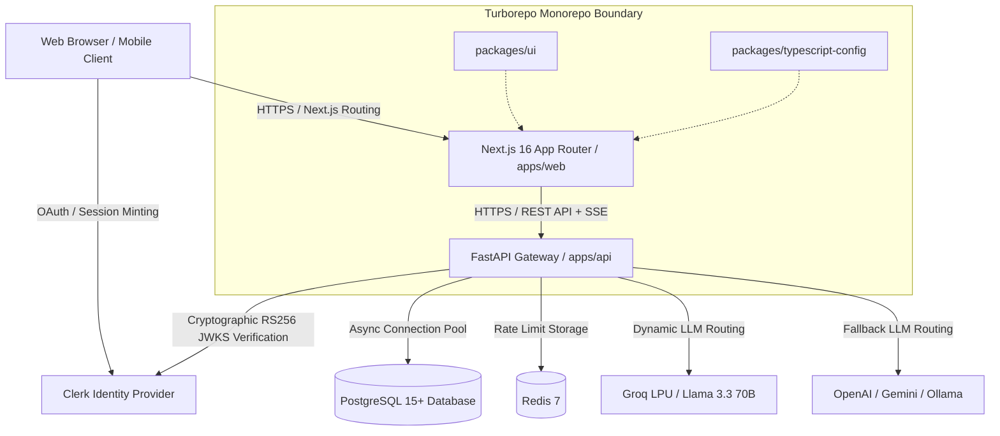
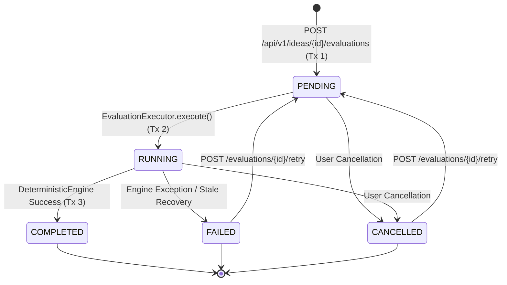

# System Architecture & Technical Design

IdeaGPT employs a decoupled client-server architecture managed within a Turborepo monorepo. This approach optimizes for separation of concerns while maintaining excellent Developer Experience (DX), unified continuous integration, and shared tooling.

---

## 🏗 1. High-Level System Topology



---

## 🧩 2. Layered Architecture & Module Boundaries

The backend application (`apps/api/app`) follows a strict layered architecture to ensure high cohesion and low coupling:

```
apps/api/app/
├── core/           # Low-level primitives: Config, Security (ClerkAuth), Logging, Rate-Limiting, DB Engine
├── db/             # Session lifecycle, Base declarative metadata, Migrations
├── models/         # SQLAlchemy 2.0 Entities with explicit Foreign Keys & Cascades
├── schemas/        # Pydantic v2 DTOs with strict input validation & output serialization
├── api/            # HTTP Presentation: Dependencies (Auth, Roles), Routers, Middleware
├── services/       # Domain business logic: Analytics, Comparison, Architecture, Quotas, Registry
├── evaluation/     # Core Engine: Coordinator (FSM), Executor (Tx Boundaries), Deterministic Engine
├── ai/             # AI Subsystem: Orchestrator, Dynamic Router, Provider Adapters, Guardrails
└── workers/        # Asynchronous task worker integration (FastAPI BackgroundTasks & Celery)
```

---

## 🔄 3. Evaluation Execution Lifecycle & State Machine

Evaluations follow a strictly enforced Finite State Machine (FSM) with isolated database transactions:



---

## ⚡ 4. Real-Time Streaming & AI Task Pipeline

In addition to fast synchronous deterministic evaluations ($<50$ms), long-running AI generation jobs utilize Server-Sent Events (SSE) streaming:

1. **Task Dispatch**: Client submits `POST /api/v1/ai/tasks` with an optional `idempotency_key`.
2. **Immediate Acknowledgment**: API enqueues the task in background workers and returns `HTTP 202 Accepted {"id": "task-uuid", "status": "QUEUED"}`.
3. **Live Streaming**: Client connects to `GET /api/v1/ai/tasks/{task_id}/stream` (`text/event-stream`) to receive live state transitions, incremental progress events, and final output payloads.

---

## 🛡️ 5. Security & Multi-Tenant Data Isolation

- **Authentication**: Validates RS256 JSON Web Tokens minted by Clerk against public JWKS endpoints with a 5-minute cache.
- **Tenant Isolation**: Every database operation enforces `Project.user_id == current_user.id` or verifies parent project ownership.
- **Configuration Security**: `Settings.validate_production_config()` enforces fail-fast validation in production mode, blocking SQLite, wildcard CORS, or missing issuers.

---

## 🧪 6. Architectural Fitness Functions

Automated architectural constraints are enforced in CI via `apps/api/tests/test_architecture_fitness.py`:

- **Layer Direction**: Lower layers (`core`, `models`, `schemas`, `db`) never import from `api.routes`.
- **Engine Purity**: `DeterministicEvaluationEngine` has 0 database, network, or external LLM dependencies.
- **Schema Standards**: All schemas use Pydantic v2 `ConfigDict` with 0 legacy `class Config:`.
- **Tenant Scoping**: Domain services require explicit `user_id` or `User` parameters.

---

## 📚 7. Architecture Decision Records (ADRs)

- [ADR-0001: Architecture Monorepo Setup](./ADR/0001-architecture.md)
- [ADR-0002: Deterministic Evaluation Engine & State Machine](./ADR/0002-deterministic-evaluation-engine.md)
- [ADR-0003: Clerk RS256 JWKS Key Verification & Multi-Tenancy](./ADR/0003-clerk-rs256-jwks-and-multi-tenancy.md)
- [ADR-0004: Multi-Provider Dynamic Discovery & AI Routing](./ADR/0004-multi-provider-dynamic-discovery-routing.md)
- [ADR-0005: Modular Monolith and Service Boundaries](./ADR/0005-modular-monolith-and-service-boundaries.md)
