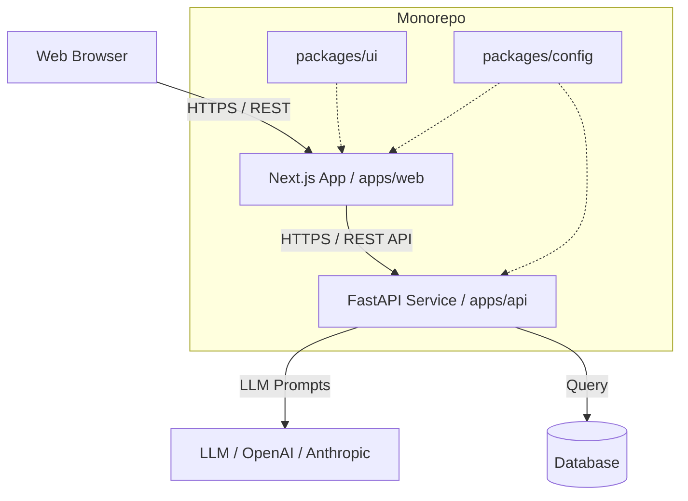

# System Architecture

IdeaGPT employs a decoupled client-server architecture managed within a Turborepo monorepo. This approach optimizes for separation of concerns while maintaining excellent Developer Experience (DX) and shared tooling.

## 🏗 High-Level System Design

## 🧩 Module Relationships (Turborepo)

The workspace is divided into executable **apps** and reusable **packages**:

### Apps
1. **`apps/web`:** The user-facing application. Responsible for authentication, state management, presenting complex data visualizations (roadmaps, architecture diagrams), and handling user inputs.
2. **`apps/api`:** The core intelligence engine. Handles API requests, orchestrates LLM calls, validates data schemas, and persists user projects.

### Packages (Shared)
- **`packages/ui`:** A shared React component library built with Tailwind CSS and Radix UI. Ensures visual consistency across any future frontend apps.
- **`packages/typescript-config`:** Base `tsconfig.json` files extended by the frontend apps.
- **`packages/types`:** Universal TypeScript definitions to maintain sync between frontend models and expected backend payloads.

## 🔄 Data Flow Example: Project Submission

1. **User Action:** The user submits a startup idea string via the UI (`apps/web/app/page.tsx`).
2. **Client Request:** Next.js (using Axios/React Query) sends a POST request with the JSON payload to the FastAPI backend (`/api/v1/projects/submit`).
3. **Validation:** FastAPI intercepts the request. The payload is validated strictly against a Pydantic schema (`app.schemas.project_schema.ProjectCreate`).
4. **Processing:** The `project_service.py` orchestrates the logic: injecting the payload into specific AI prompts and making asynchronous calls to the configured LLM.
5. **Response:** The LLM output is structured, parsed back into a validated JSON response, and sent back to the Next.js client.
6. **State Update:** Zustand/React Query updates the client state, and Framer Motion handles the dynamic rendering of the resulting technical roadmap.

## 🛠 Key Engineering Decisions

### 1. Python + FastAPI for Backend
*Why not Node.js/Next.js API Routes?*
While Next.js has built-in API capabilities, IdeaGPT's core value is AI reasoning. Python provides a drastically superior ecosystem for AI, ML, and data parsing (e.g., LangChain, LlamaIndex, robust OpenAI SDKs). FastAPI was chosen for its extreme performance (built on Starlette) and native async support, which is critical when waiting for slow LLM responses.

### 2. Next.js App Router for Frontend
*Why App Router?*
The App Router allows us to utilize React Server Components (RSC) to reduce client-side bundle sizes and dramatically improve Time-to-First-Byte (TTFB), which is essential for a premium landing page experience.

### 3. Turborepo Monorepo
*Why a Monorepo?*
Managing two distinct ecosystems (Node/React and Python) typically leads to configuration drift. Turborepo allows us to cache build outputs, run concurrent dev scripts, and share linting/formatting rules from a single root directory.
