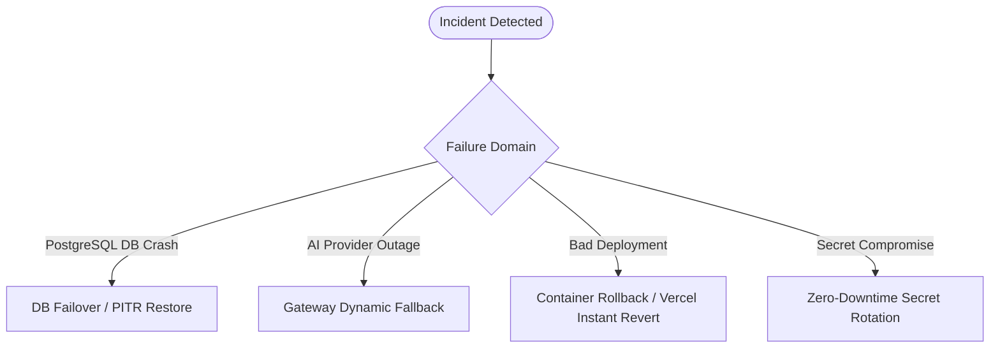

# IdeaGPT — Private-Beta Disaster Recovery & Incident Response Guide

**Product**: IdeaGPT  
**Version**: 1.0.0-rc1  
**Target RTO (Recovery Time Objective)**: < 15 minutes  
**Target RPO (Recovery Point Objective)**: < 5 minutes (via automated PostgreSQL WAL / PITR)  

---

## 1. Failure Scenarios & Recovery Procedures

---

### Scenario A: Managed PostgreSQL Database Outage or Corruption
1. **Detection**:
   - `/health/ready` returns `HTTP 503 Service Unavailable` with `{"status": "unready", "error": "Database connectivity check failed"}`.
   - SRE alert triggers on connection timeout.
2. **Immediate Mitigation**:
   - Check cloud database health (AWS RDS / Supabase / Neon).
   - If instance crashed, trigger automated multi-AZ failover.
3. **Data Recovery / Point-In-Time Restore (PITR)**:
   - If data corruption occurred due to unintended batch deletion, initiate PITR to `T - 10 minutes` in cloud console.
   - Update `DATABASE_URL` in container environment and restart FastAPI API pods.
   - Verify `alembic check` and execute `/health/ready` to confirm clean recovery.

---

### Scenario B: Primary AI Provider (Groq LPU) Outage or Severe Rate Limiting
1. **Detection**:
   - AI evaluations report `429 Too Many Requests` or timeout errors in task queue logs.
2. **Automated Recovery**:
   - `CapabilityRouter` automatically reroutes incoming requests to fallback providers (`OpenAI GPT-4o-mini` or `Gemini 2.0 Flash`).
   - If all external AI providers are offline, the system gracefully enters `AI_UNAVAILABLE` mode. Deterministic core features (projects, ideas, roadmaps, comparison matrix, analytics, reports) remain 100% operational.
3. **Operator Action**:
   - If Groq quota exhausted, increase rate limit tier in Groq console or configure secondary API key.

---

### Scenario C: Redis Outage / Cache Eviction
1. **Architecture Resilience**:
   - Authoritative data is stored in PostgreSQL. Redis acts as an ephemeral cache and distributed rate limiter only.
   - If Redis becomes unavailable, in-memory caching and per-pod rate limiting automatically take over without application crash or data loss.

---

### Scenario D: Compromised API Key or JWT Secret
1. **Immediate Revocation**:
   - Generate new API key in provider console (Groq, OpenAI, Clerk).
   - Update environment secret in cloud secrets manager (AWS Secrets Manager / Vercel Environment Variables).
   - Trigger rolling restart of API containers.
2. **Revocation Invalidation**:
   - Revoke old API key in provider console.
   - Inspect access logs for `x-request-id` correlated anomalies.

---

### Scenario E: Failed Deployment / Bad Code Release
1. **Frontend Rollback**:
   - Instant rollback in Vercel Dashboard to previous verified deployment hash (instant, zero-downtime).
2. **Backend Rollback**:
   - In container orchestrator (ECS Fargate / Render / K8s), redeploy previous Docker container image tag (e.g. `ideagpt-api:1.0.0-rc0`).
   - Database migrations are designed to be backward-compatible (non-destructive column additions), enabling immediate API rollback without requiring schema down-migrations.
