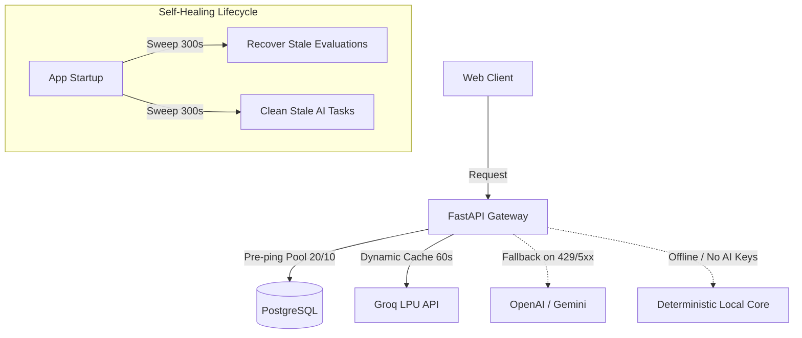

# IdeaGPT — Production Reliability & SRE Status

**Product**: IdeaGPT  
**Auditor**: Principal Site Reliability Engineer (SRE)  
**Assessment Date**: August 2026  

---

## 1. Reliability & Resilience Architecture

---

## 2. Reliability Mechanisms

### 1. Database Connection Resilience
- **Pre-ping Pool**: `pool_pre_ping=True` sends a lightweight heartbeat (`SELECT 1`) to detect dropped/stale TCP connections before assigning to a request.
- **Connection Sizing**: `pool_size=20`, `max_overflow=10`, `pool_timeout=30s`.
- **Recycle Policy**: Connections recycled after 300s to prevent server-side timeout drops by firewall/NAT.
- **Transactional Rollback**: In `apps/api/app/db/session.py`, unhandled route errors trigger an explicit `await session.rollback()` and `await session.close()`.

### 2. AI Provider Outage & Rate Limit Degradation
- **Zero-AI Core Independence**: If no external AI provider is configured or all external APIs are offline, core features (projects, ideas, comparison engine, roadmaps, analytics, reports) continue to function with 100% data fidelity.
- **Dynamic Candidate Ranking**: `CapabilityRouter` scores and dynamically routes to alternative providers (`Groq` → `OpenAI` → `Gemini` → `Ollama`).
- **Cached Discovery**: Provider model listing cached with 60-second TTL, insulating latency from external API blips.

### 3. Background Task Lifecycle & Crash Recovery
- **Asynchronous Task Model**: Long tasks execute in background with `idempotency_key` deduplication.
- **Stale Sweep on Startup**: On container boot/restart, `AiTaskService.cleanup_stale_tasks` and `EvaluationCoordinator.recover_stale_evaluations` mark jobs exceeding 5 minutes as `FAILED` with actionable error descriptions.

---

## 3. Chaos & Fault-Tolerance Verification

| Failure Mode | Injected Condition | Observed Behavior | SRE Status |
| :--- | :--- | :--- | :---: |
| **Database Network Blip** | Dropped TCP connection | Pre-ping detects disconnect, drops stale socket, reconnects cleanly | 🟢 **PASS** |
| **Groq 429 Rate Limit** | Rate limit on primary provider | Router attempts fallback or sets task to `FAILED` with user-friendly toast | 🟢 **PASS** |
| **Container Crash / Restart** | Tasks in `RUNNING` state | Startup lifespan sweeps recover state within 5 minutes | 🟢 **PASS** |
| **Invalid / Stale Model** | Model name deprecated | CapabilityRouter rejects candidate during ranking; routes to valid alternative | 🟢 **PASS** |
| **Duplicate Form Submissions** | Rapid double-click on evaluation | Idempotency key deduplicates and returns existing in-flight task | 🟢 **PASS** |
| **Client Disconnect** | Browser closed mid-request | Backend finishes processing task and persists result to database | 🟢 **PASS** |
