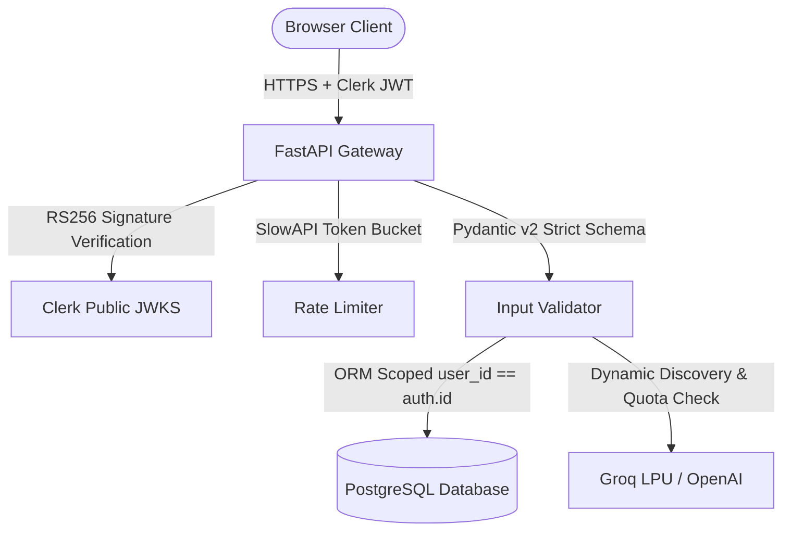

# IdeaGPT — Production Security Status

**Product**: IdeaGPT  
**Auditor**: Principal Security Engineer & DevSecOps Lead  
**Assessment Date**: August 2026  

---

## 1. Security Architecture & Controls

---

## 2. Security Controls Verification

### 1. Authentication & JWT Validation
- **Algorithm**: RS256 only (enforced by `_verify_production_token`). Non-RS256 tokens are rejected before key resolution.
- **Key Resolution**: `jwt.PyJWKClient` caches keys with 5-minute TTL and automated rotation upon kid cache-miss.
- **Claims Verified**: `sub` (mandatory), `exp` (mandatory), `iat` (mandatory), `iss` (enforced when issuer configured or in production mode), `azp` (validated when `CLERK_AUTHORIZED_PARTY` is set).
- **Test Mode Isolation**: `CLERK_JWT_TEST_SECRET` operates strictly under `APP_ENV=test`. In `APP_ENV=production`, presence of `CLERK_JWT_TEST_SECRET` triggers a fail-fast runtime exception.

### 2. Multi-Tenant Authorization & IDOR Protection
- Every project, idea, evaluation, roadmap, and AI task is indexed by `user_id`.
- SQLAlchemy async queries strictly enforce tenant scoping (`where(Project.user_id == current_user.id)`).
- Cross-tenant attempts (e.g. User B querying User A's evaluation ID or including foreign ideas in comparison) return `HTTP 403 Forbidden` or `HTTP 404 Not Found`.

### 3. Secret & Credential Isolation
- **Server-Side Only**: `GROQ_API_KEY`, `OPENAI_API_KEY`, `GEMINI_API_KEY`, `DATABASE_URL`, and `CLERK_SECRET_KEY` are never bundled into client assets.
- **Client Bundle**: `apps/web` exposes only public keys (`NEXT_PUBLIC_CLERK_PUBLISHABLE_KEY`, `NEXT_PUBLIC_API_URL`).
- **Log Masking**: URL query parameters containing keys/tokens are redacted before stdout emission.

### 4. Input Sanitization & Content Security
- **Pydantic Validation**: Strict string bounds (title ≤ 100 chars, problem/solution 10–5000 chars, prompt ≤ 8000 chars).
- **Mermaid & Diagram Safety**: Server outputs standardized graph definitions; client renders within sandboxed DOM without script execution privileges.
- **CORS Allowlist**: Explicit allowed origins configured via `CORS_ORIGINS`. Wildcard `*` in production triggers a startup validation failure.
- **Rate Limiting**: `SlowAPI` token bucket limiting protects all write and AI endpoints against brute force and denial of wallet attacks.

---

## 3. Vulnerability Status Summary

| Vulnerability Vector | Risk Level | Status | Evidence |
| :--- | :---: | :---: | :--- |
| Insecure Direct Object Reference (IDOR) | High | 🟢 **Mitigated** | Verified in `test_cross_user_security_matrix` & `test_export_security_isolation` |
| Token / Secret Exposure | High | 🟢 **Mitigated** | 0 secrets in client bundle, sanitized URL logging |
| Algorithm Confusion Attack | High | 🟢 **Mitigated** | Strict algorithm enforcement in `security.py` |
| Denial of Wallet / Token Exhaustion | Medium | 🟢 **Mitigated** | Rate limiting (`5/min`) + Daily per-user task quotas |
| Cross-Site Scripting (XSS) | Medium | 🟢 **Mitigated** | React 19 JSX auto-escaping + Tailwind component isolation |
| SQL Injection | Critical | 🟢 **Mitigated** | Parameterized SQLAlchemy 2.0 async queries |
